# MonKobra Analytics: Session: 2026-11-10 11:10:56 (mock)

MonKobra v1.0.0-beta

## Session Summary

#### Death Causes

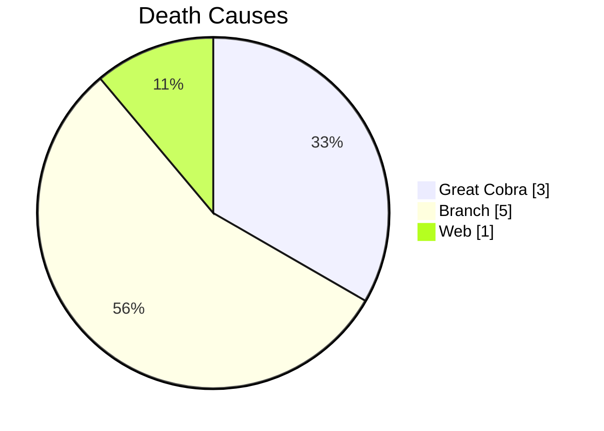
```mermaid
pie showData
    title Death Causes
    "Great Cobra" : 3
    "Branch" : 5
    "Web" : 1
```

#### Final Score vs Run

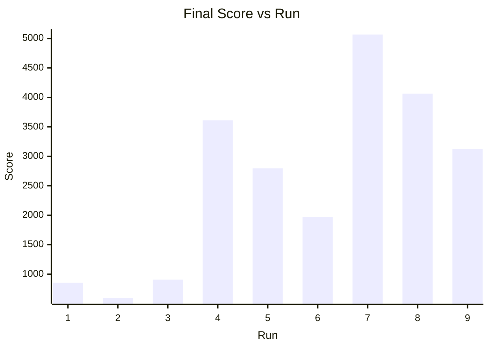
```mermaid
xychart-beta
    title "Final Score vs Run"
    x-axis "Run" ["1", "2", "3", "4", "5", "6", "7", "8", "9"]
    y-axis "Score"
    bar [856, 594, 907, 3609, 2796, 1972, 5067, 4062, 3129]
```

#### Highest Height vs Run

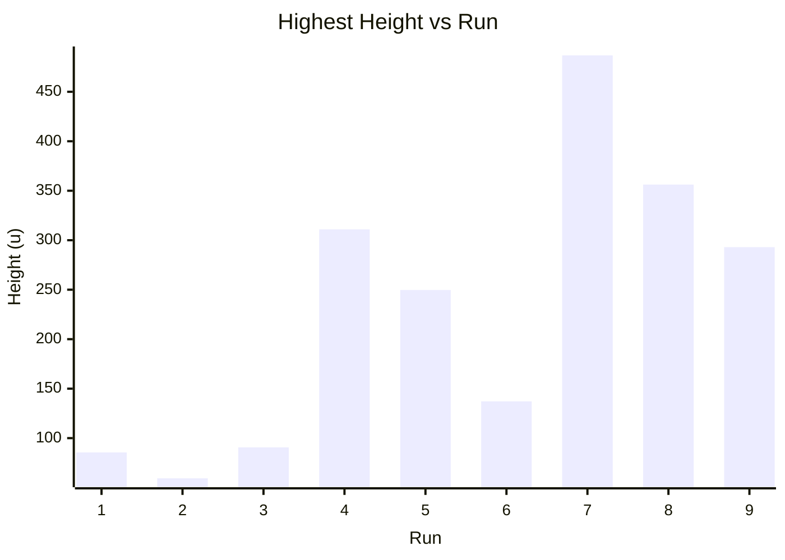
```mermaid
xychart-beta
    title "Highest Height vs Run"
    x-axis "Run" ["1", "2", "3", "4", "5", "6", "7", "8", "9"]
    y-axis "Height (u)"
    bar [85.6, 59.4, 90.7, 311, 249.7, 137.2, 486.8, 356.2, 293]
```

#### Death Height vs Run

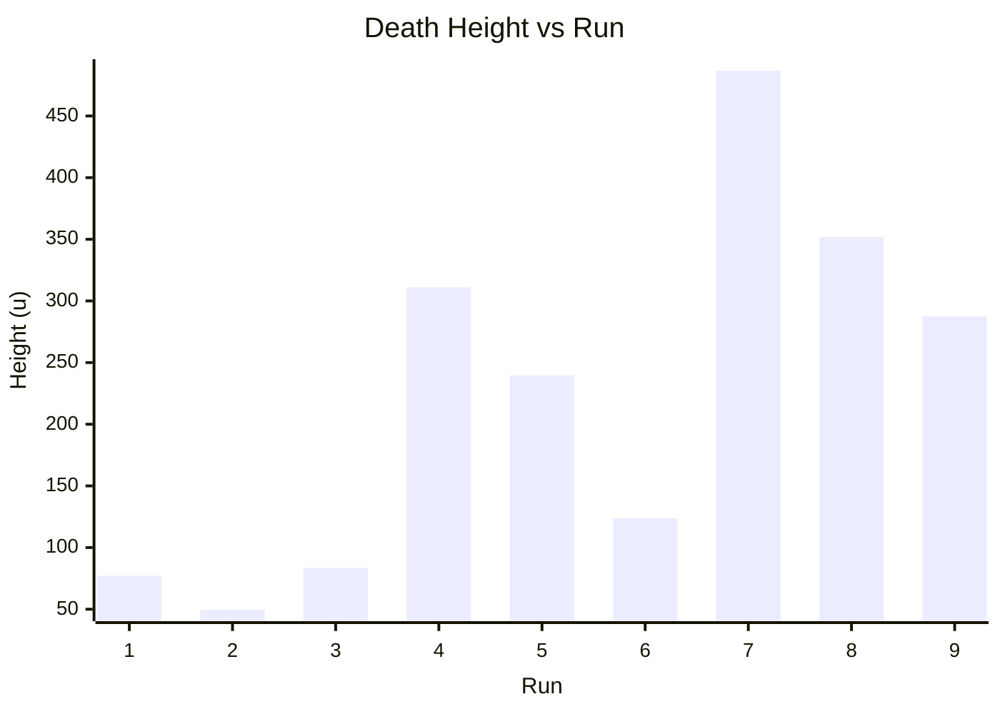
```mermaid
xychart-beta
    title "Death Height vs Run"
    x-axis "Run" ["1", "2", "3", "4", "5", "6", "7", "8", "9"]
    y-axis "Height (u)"
    bar [77.2, 49.5, 83.5, 311, 239.6, 123.8, 486.8, 352, 287.4]
```

#### Duration vs Run

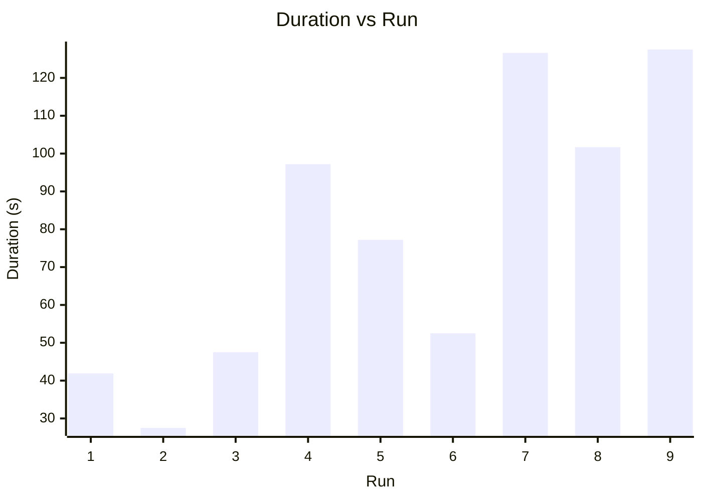
```mermaid
xychart-beta
    title "Duration vs Run"
    x-axis "Run" ["1", "2", "3", "4", "5", "6", "7", "8", "9"]
    y-axis "Duration (s)"
    bar [41.9, 27.5, 47.5, 97.2, 77.2, 52.5, 126.6, 101.7, 127.5]
```

## Run 1

- Mode: Full
- Highest Height: +85.6
- Death Height: +77.2
- Death Cause: Great Cobra

#### Run Duration: 41.9 s

- Time Start: 11:10:56
- Time Stop: 11:11:38
- Starting Zone Exit: +00:00:07, y +20.3

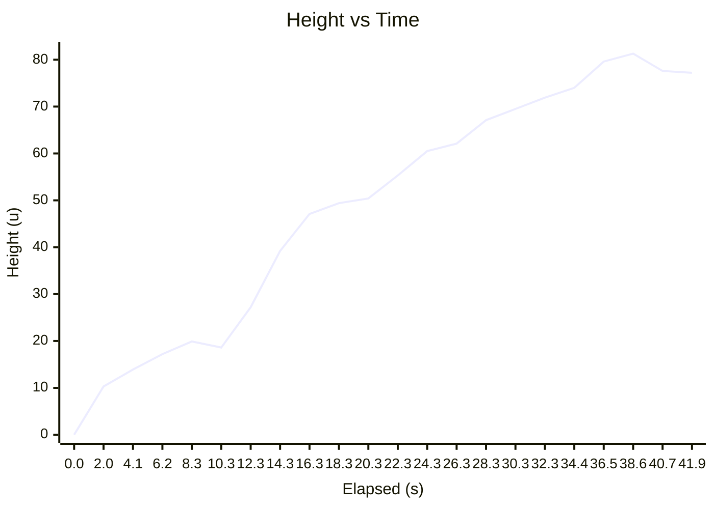
```mermaid
xychart-beta
    title "Height vs Time"
    x-axis "Elapsed (s)" [0.0, 2.0, 4.1, 6.2, 8.3, 10.3, 12.3, 14.3, 16.3, 18.3, 20.3, 22.3, 24.3, 26.3, 28.3, 30.3, 32.3, 34.4, 36.5, 38.6, 40.7, 41.9]
    y-axis "Height (u)" 0 --> 82
    line [0.0, 10.3, 13.9, 17.2, 19.9, 18.6, 27.2, 39.2, 47.1, 49.4, 50.4, 55.3, 60.5, 62.1, 67.1, 69.5, 71.9, 74.0, 79.6, 81.3, 77.6, 77.2]
```

#### Final Score: 856

- Score from Height: 856
- Score from Banana: 0
- Score from Coconut: 0

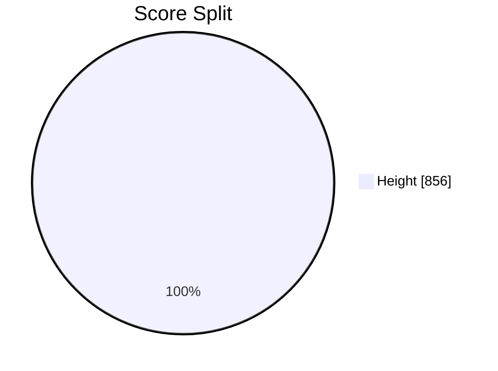
```mermaid
pie showData
    title Score Split
    "Height" : 856
```

#### Banana Count: 0

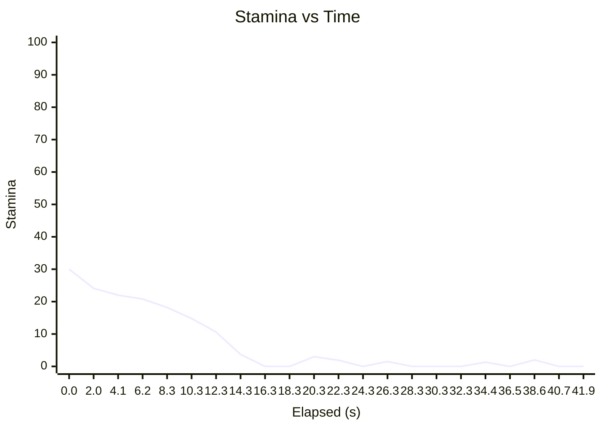
```mermaid
xychart-beta
    title "Stamina vs Time"
    x-axis "Elapsed (s)" [0.0, 2.0, 4.1, 6.2, 8.3, 10.3, 12.3, 14.3, 16.3, 18.3, 20.3, 22.3, 24.3, 26.3, 28.3, 30.3, 32.3, 34.4, 36.5, 38.6, 40.7, 41.9]
    y-axis "Stamina" 0 --> 100
    line [30.0, 24.1, 22.0, 20.8, 18.2, 14.8, 10.6, 3.7, 0.0, 0.0, 3.0, 1.9, 0.0, 1.5, 0.0, 0.0, 0.0, 1.3, 0.0, 2.0, 0.0, 0.0]
```

#### Coconut Count: 0

#### Coconut Used: 0

#### Web Encounter: 0

#### Branch Hit: 2

| # | Time | y |
|---|---|---|
| 1 | +00:00:08 | 22.3 |
| 2 | +00:00:39 | 85.6 |

#### Pineapple Leap: 0

#### Rough Bark Contact: 0

#### Cobra Freeze: 0

#### Pause: 0

#### Boss Fight Start: 0

#### Armor Save: 0

#### Boss Revive: 0

## Run 2

- Mode: Full
- Highest Height: +59.4
- Death Height: +49.5
- Death Cause: Branch

#### Run Duration: 27.5 s

- Time Start: 11:11:43
- Time Stop: 11:12:10
- Starting Zone Exit: +00:00:08, y +20.2

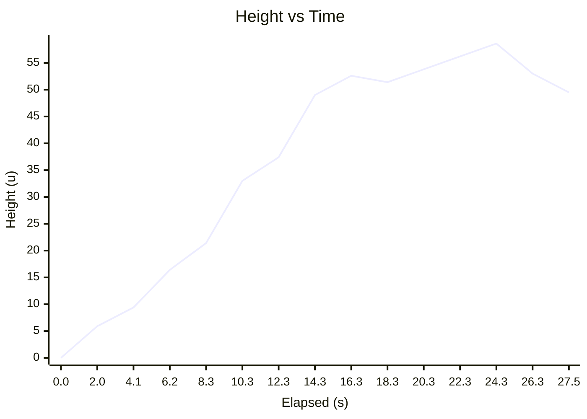
```mermaid
xychart-beta
    title "Height vs Time"
    x-axis "Elapsed (s)" [0.0, 2.0, 4.1, 6.2, 8.3, 10.3, 12.3, 14.3, 16.3, 18.3, 20.3, 22.3, 24.3, 26.3, 27.5]
    y-axis "Height (u)" 0 --> 59
    line [0.0, 5.9, 9.4, 16.4, 21.4, 33.0, 37.4, 49.0, 52.6, 51.4, 53.8, 56.2, 58.6, 53.0, 49.5]
```

#### Final Score: 594

- Score from Height: 594
- Score from Banana: 0
- Score from Coconut: 0

```mermaid
pie showData
    title Score Split
    "Height" : 594
```

#### Banana Count: 0

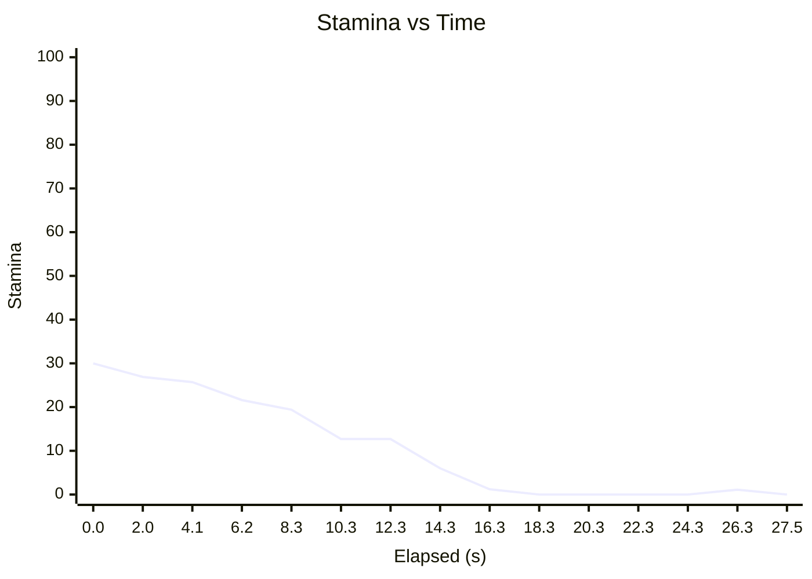
```mermaid
xychart-beta
    title "Stamina vs Time"
    x-axis "Elapsed (s)" [0.0, 2.0, 4.1, 6.2, 8.3, 10.3, 12.3, 14.3, 16.3, 18.3, 20.3, 22.3, 24.3, 26.3, 27.5]
    y-axis "Stamina" 0 --> 100
    line [30.0, 26.9, 25.7, 21.6, 19.4, 12.7, 12.7, 6.0, 1.2, 0.0, 0.0, 0.0, 0.0, 1.1, 0.0]
```

#### Coconut Count: 0

#### Coconut Used: 0

#### Web Encounter: 0

#### Branch Hit: 3

| # | Time | y |
|---|---|---|
| 1 | +00:00:15 | 57.4 |
| 2 | +00:00:25 | 59.4 |
| 3 | +00:00:27 | 51.9 |

#### Pineapple Leap: 0

#### Rough Bark Contact: 0

#### Cobra Freeze: 0

#### Pause: 0

#### Boss Fight Start: 0

#### Armor Save: 0

#### Boss Revive: 0

## Run 3

- Mode: Full
- Highest Height: +90.7
- Death Height: +83.5
- Death Cause: Branch

#### Run Duration: 47.5 s

- Time Start: 11:12:17
- Time Stop: 11:13:05
- Starting Zone Exit: +00:00:04, y +20.3

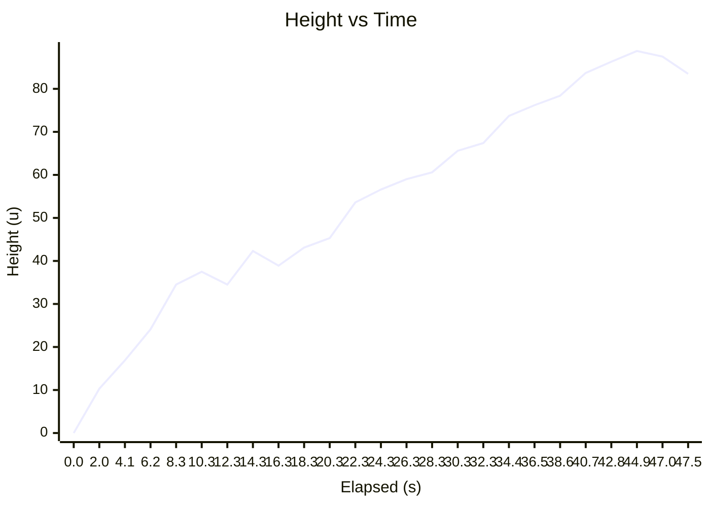
```mermaid
xychart-beta
    title "Height vs Time"
    x-axis "Elapsed (s)" [0.0, 2.0, 4.1, 6.2, 8.3, 10.3, 12.3, 14.3, 16.3, 18.3, 20.3, 22.3, 24.3, 26.3, 28.3, 30.3, 32.3, 34.4, 36.5, 38.6, 40.7, 42.8, 44.9, 47.0, 47.5]
    y-axis "Height (u)" 0 --> 89
    line [0.0, 10.3, 16.9, 24.1, 34.5, 37.5, 34.5, 42.3, 38.9, 43.1, 45.3, 53.6, 56.6, 59.0, 60.6, 65.6, 67.4, 73.7, 76.2, 78.4, 83.7, 86.3, 88.8, 87.5, 83.5]
```

#### Final Score: 907

- Score from Height: 907
- Score from Banana: 0
- Score from Coconut: 0

```mermaid
pie showData
    title Score Split
    "Height" : 907
```

#### Banana Count: 0

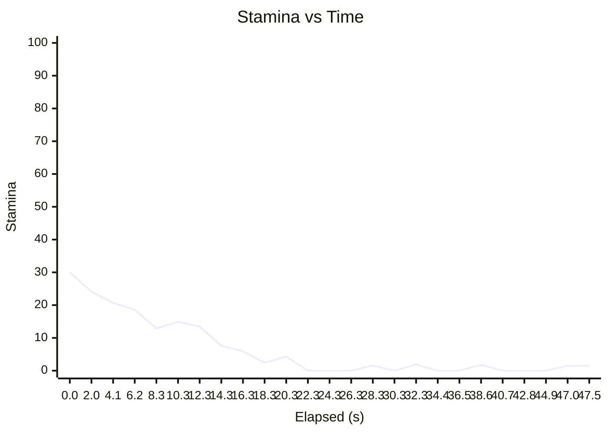
```mermaid
xychart-beta
    title "Stamina vs Time"
    x-axis "Elapsed (s)" [0.0, 2.0, 4.1, 6.2, 8.3, 10.3, 12.3, 14.3, 16.3, 18.3, 20.3, 22.3, 24.3, 26.3, 28.3, 30.3, 32.3, 34.4, 36.5, 38.6, 40.7, 42.8, 44.9, 47.0, 47.5]
    y-axis "Stamina" 0 --> 100
    line [30.0, 24.1, 20.7, 18.6, 12.9, 14.9, 13.5, 7.6, 5.9, 2.4, 4.3, 0.0, 0.0, 0.0, 1.6, 0.0, 1.9, 0.0, 0.0, 1.8, 0.0, 0.0, 0.0, 1.5, 1.5]
```

#### Coconut Count: 0

#### Coconut Used: 0

#### Web Encounter: 0

#### Branch Hit: 3

| # | Time | y |
|---|---|---|
| 1 | +00:00:11 | 41.7 |
| 2 | +00:00:15 | 45.3 |
| 3 | +00:00:46 | 90.7 |

#### Pineapple Leap: 0

#### Rough Bark Contact: 0

#### Cobra Freeze: 0

#### Pause: 0

#### Boss Fight Start: 0

#### Armor Save: 0

#### Boss Revive: 0

## Run 4

- Mode: Full
- Highest Height: +311.0
- Death Height: +311.0
- Death Cause: Great Cobra

#### Run Duration: 97.2 s

- Time Start: 11:13:13
- Time Stop: 11:14:51
- Starting Zone Exit: +00:00:08, y +20.3

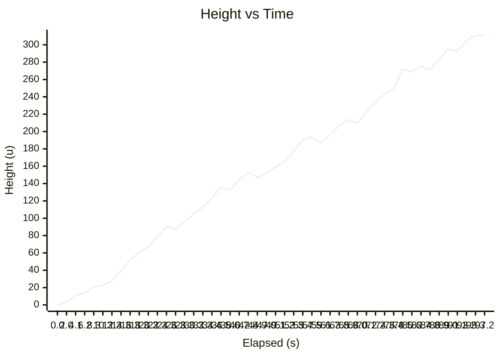
```mermaid
xychart-beta
    title "Height vs Time"
    x-axis "Elapsed (s)" [0.0, 2.0, 4.1, 6.2, 8.3, 10.3, 12.3, 14.3, 16.3, 18.3, 20.3, 22.3, 24.3, 26.3, 28.3, 30.3, 32.3, 34.4, 36.5, 38.6, 40.7, 42.8, 44.9, 47.0, 49.1, 51.2, 53.3, 55.4, 57.5, 59.6, 61.7, 63.8, 65.9, 68.0, 70.1, 72.2, 74.3, 76.4, 78.5, 80.6, 82.7, 84.8, 86.9, 89.0, 91.1, 93.2, 95.3, 97.2]
    y-axis "Height (u)" 0 --> 311
    line [0.0, 3.3, 10.7, 13.8, 20.8, 22.6, 27.6, 39.6, 51.6, 60.1, 67.4, 78.7, 90.7, 87.3, 95.7, 104.9, 113.3, 123.5, 136.1, 131.9, 144.5, 153.2, 146.9, 152.5, 158.9, 164.8, 177.4, 190.0, 193.6, 186.9, 196.0, 206.5, 213.8, 209.6, 222.2, 234.8, 242.8, 249.2, 271.7, 268.9, 275.5, 271.3, 283.9, 295.1, 292.4, 305.0, 311.0, 311.0]
```

#### Final Score: 3609

- Score from Height: 3109
- Score from Banana: 100 * 5 = 500
- Score from Coconut: 0

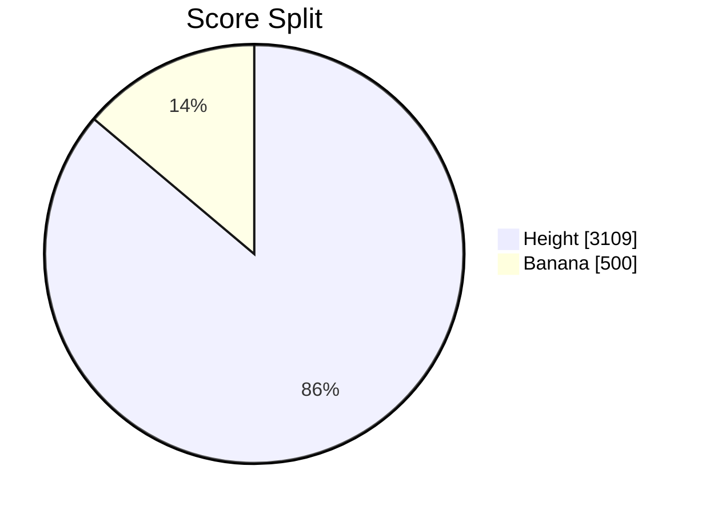
```mermaid
pie showData
    title Score Split
    "Height" : 3109
    "Banana" : 500
```

#### Banana Count: 5

| # | Time | y |
|---|---|---|
| 1 | +00:00:02 | 4.3 |
| 2 | +00:00:04 | 12.0 |
| 3 | +00:00:31 | 113.3 |
| 4 | +00:00:49 | 161.9 |
| 5 | +00:01:20 | 270.7 |

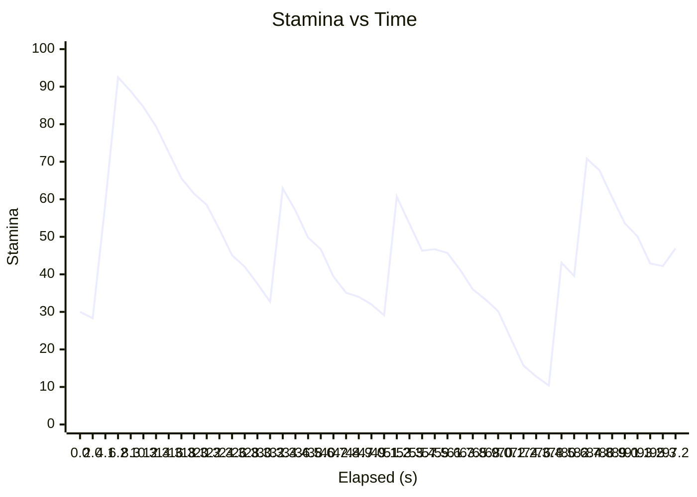
```mermaid
xychart-beta
    title "Stamina vs Time"
    x-axis "Elapsed (s)" [0.0, 2.0, 4.1, 6.2, 8.3, 10.3, 12.3, 14.3, 16.3, 18.3, 20.3, 22.3, 24.3, 26.3, 28.3, 30.3, 32.3, 34.4, 36.5, 38.6, 40.7, 42.8, 44.9, 47.0, 49.1, 51.2, 53.3, 55.4, 57.5, 59.6, 61.7, 63.8, 65.9, 68.0, 70.1, 72.2, 74.3, 76.4, 78.5, 80.6, 82.7, 84.8, 86.9, 89.0, 91.1, 93.2, 95.3, 97.2]
    y-axis "Stamina" 0 --> 100
    line [30.0, 28.3, 59.1, 92.5, 88.8, 84.6, 79.4, 72.5, 65.6, 61.5, 58.5, 52.0, 45.1, 42.0, 37.5, 32.7, 62.9, 57.0, 49.8, 46.7, 39.4, 35.1, 34.0, 32.0, 29.1, 60.7, 53.5, 46.3, 46.7, 45.7, 41.2, 36.0, 33.3, 30.2, 22.9, 15.7, 12.8, 10.4, 43.1, 39.6, 70.8, 67.7, 60.5, 53.6, 50.1, 42.9, 42.2, 46.9]
```

#### Coconut Count: 0

#### Coconut Used: 0

#### Web Encounter: 1

| # | Time |
|---|---|
| 1 | +00:01:34 |

#### Branch Hit: 9

| # | Time | y |
|---|---|---|
| 1 | +00:00:09 | 28.2 |
| 2 | +00:00:25 | 96.1 |
| 3 | +00:00:37 | 140.3 |
| 4 | +00:00:43 | 155.6 |
| 5 | +00:00:57 | 194.1 |
| 6 | +00:01:06 | 217.4 |
| 7 | +00:01:18 | 272.5 |
| 8 | +00:01:23 | 280.9 |
| 9 | +00:01:28 | 295.9 |

#### Pineapple Leap: 1

| # | Time | y |
|---|---|---|
| 1 | +00:01:16 | 249.2 |

#### Rough Bark Contact: 2

| # | Time | y |
|---|---|---|
| 1 | +00:00:46 | 151.3 |
| 2 | +00:00:55 | 192.4 |

#### Cobra Freeze: 0

#### Pause: 1

| # | Time | y |
|---|---|---|
| 1 | +00:00:05 | 12.0 |

#### Boss Fight Start: 0

#### Armor Save: 0

#### Boss Revive: 0

## Run 5

- Mode: Full
- Highest Height: +249.7
- Death Height: +239.6
- Death Cause: Branch

#### Run Duration: 77.2 s

- Time Start: 11:14:55
- Time Stop: 11:16:12
- Starting Zone Exit: +00:00:05, y +20.5

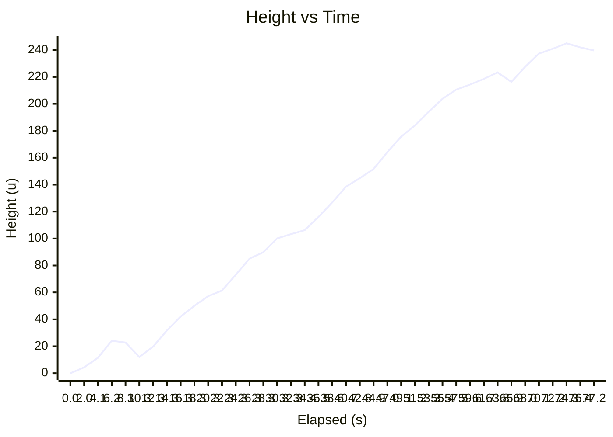
```mermaid
xychart-beta
    title "Height vs Time"
    x-axis "Elapsed (s)" [0.0, 2.0, 4.1, 6.2, 8.3, 10.3, 12.3, 14.3, 16.3, 18.3, 20.3, 22.3, 24.3, 26.3, 28.3, 30.3, 32.3, 34.4, 36.5, 38.6, 40.7, 42.8, 44.9, 47.0, 49.1, 51.2, 53.3, 55.4, 57.5, 59.6, 61.7, 63.8, 65.9, 68.0, 70.1, 72.2, 74.3, 76.4, 77.2]
    y-axis "Height (u)" 0 --> 245
    line [0.0, 4.4, 11.5, 24.1, 22.8, 12.1, 19.7, 31.7, 42.1, 50.1, 57.2, 61.4, 73.1, 85.1, 89.9, 100.1, 103.2, 106.2, 116.0, 126.8, 138.5, 144.8, 151.6, 164.2, 175.6, 183.9, 194.1, 203.7, 210.6, 214.3, 218.5, 223.3, 216.3, 227.5, 237.3, 240.9, 244.9, 241.9, 239.6]
```

#### Final Score: 2796

- Score from Height: 2496
- Score from Banana: 100 * 3 = 300
- Score from Coconut: 0

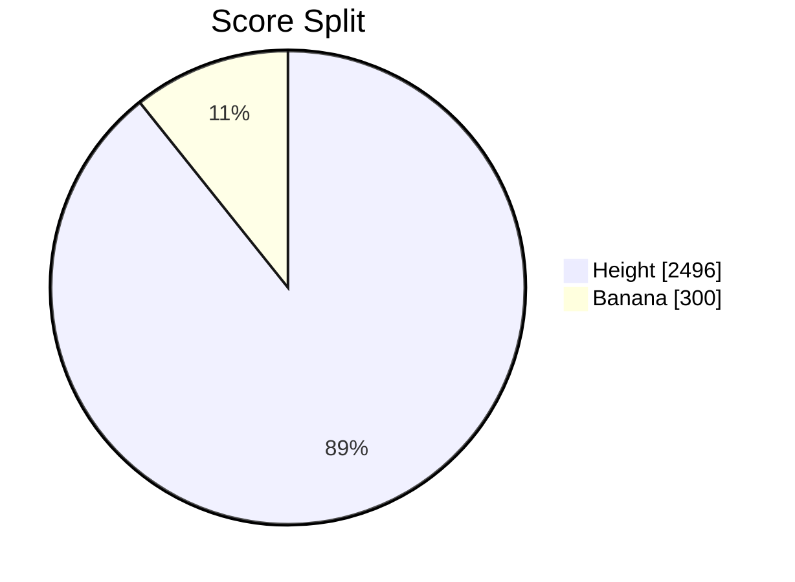
```mermaid
pie showData
    title Score Split
    "Height" : 2496
    "Banana" : 300
```

#### Banana Count: 3

| # | Time | y |
|---|---|---|
| 1 | +00:00:00 | 2.3 |
| 2 | +00:00:02 | 9.1 |
| 3 | +00:00:36 | 116.0 |

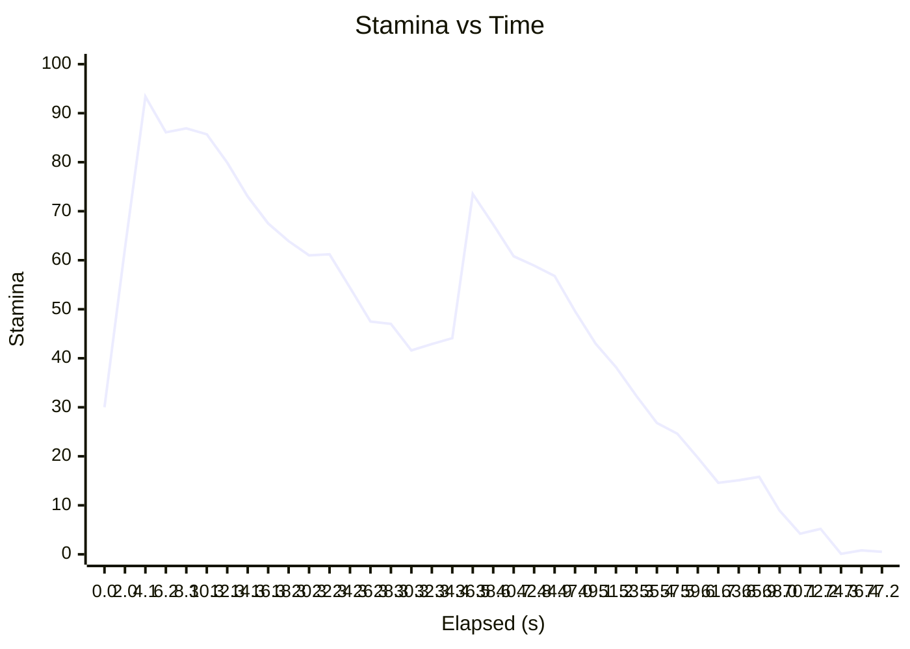
```mermaid
xychart-beta
    title "Stamina vs Time"
    x-axis "Elapsed (s)" [0.0, 2.0, 4.1, 6.2, 8.3, 10.3, 12.3, 14.3, 16.3, 18.3, 20.3, 22.3, 24.3, 26.3, 28.3, 30.3, 32.3, 34.4, 36.5, 38.6, 40.7, 42.8, 44.9, 47.0, 49.1, 51.2, 53.3, 55.4, 57.5, 59.6, 61.7, 63.8, 65.9, 68.0, 70.1, 72.2, 74.3, 76.4, 77.2]
    y-axis "Stamina" 0 --> 100
    line [30.0, 62.4, 93.4, 86.1, 86.9, 85.7, 79.9, 73.0, 67.5, 63.9, 61.0, 61.2, 54.4, 47.5, 47.0, 41.6, 42.9, 44.1, 73.5, 67.3, 60.8, 58.9, 56.8, 49.6, 43.0, 38.2, 32.3, 26.8, 24.6, 19.7, 14.6, 15.1, 15.8, 8.9, 4.2, 5.2, 0.1, 0.8, 0.5]
```

#### Coconut Count: 0

#### Coconut Used: 0

#### Web Encounter: 0

#### Branch Hit: 6

| # | Time | y |
|---|---|---|
| 1 | +00:00:07 | 26.8 |
| 2 | +00:00:09 | 19.3 |
| 3 | +00:00:59 | 219.1 |
| 4 | +00:01:04 | 225.1 |
| 5 | +00:01:13 | 249.7 |
| 6 | +00:01:16 | 242.8 |

#### Pineapple Leap: 0

#### Rough Bark Contact: 1

| # | Time | y |
|---|---|---|
| 1 | +00:00:48 | 175.0 |

#### Cobra Freeze: 0

#### Pause: 1

| # | Time | y |
|---|---|---|
| 1 | +00:00:12 | 19.7 |

#### Boss Fight Start: 0

#### Armor Save: 0

#### Boss Revive: 0

## Run 6

- Mode: Full
- Highest Height: +137.2
- Death Height: +123.8
- Death Cause: Branch

#### Run Duration: 52.5 s

- Time Start: 11:16:22
- Time Stop: 11:17:14
- Starting Zone Exit: +00:00:09, y +20.4

```mermaid
xychart-beta
    title "Height vs Time"
    x-axis "Elapsed (s)" [0.0, 2.0, 4.1, 6.2, 8.3, 10.3, 12.3, 14.3, 16.3, 18.3, 20.3, 22.3, 24.3, 26.3, 28.3, 30.3, 32.3, 34.4, 36.5, 38.6, 40.7, 42.8, 44.9, 47.0, 49.1, 51.2, 52.5]
    y-axis "Height (u)" 0 --> 136
    line [0.0, 5.6, 12.1, 14.2, 15.6, 21.3, 23.1, 34.4, 44.8, 42.8, 39.3, 45.5, 44.9, 52.7, 64.7, 76.7, 82.7, 86.6, 98.2, 106.0, 115.8, 120.0, 122.3, 128.7, 135.4, 130.0, 123.8]
```

#### Final Score: 1972

- Score from Height: 1372
- Score from Banana: 100 * 6 = 600
- Score from Coconut: 0

```mermaid
pie showData
    title Score Split
    "Height" : 1372
    "Banana" : 600
```

#### Banana Count: 6

| # | Time | y |
|---|---|---|
| 1 | +00:00:01 | 5.6 |
| 2 | +00:00:03 | 12.1 |
| 3 | +00:00:06 | 14.2 |
| 4 | +00:00:30 | 80.3 |
| 5 | +00:00:37 | 102.4 |
| 6 | +00:00:44 | 122.3 |

```mermaid
xychart-beta
    title "Stamina vs Time"
    x-axis "Elapsed (s)" [0.0, 2.0, 4.1, 6.2, 8.3, 10.3, 12.3, 14.3, 16.3, 18.3, 20.3, 22.3, 24.3, 26.3, 28.3, 30.3, 32.3, 34.4, 36.5, 38.6, 40.7, 42.8, 44.9, 47.0, 49.1, 51.2, 52.5]
    y-axis "Stamina" 0 --> 100
    line [30.0, 61.8, 93.0, 92.7, 99.5, 98.0, 99.5, 93.0, 87.5, 87.7, 89.4, 85.8, 82.0, 76.2, 69.3, 62.4, 93.9, 94.2, 87.5, 97.9, 93.3, 93.7, 100.0, 97.3, 93.4, 91.0, 90.0]
```

#### Coconut Count: 0

#### Coconut Used: 0

#### Web Encounter: 0

#### Branch Hit: 4

| # | Time | y |
|---|---|---|
| 1 | +00:00:17 | 47.6 |
| 2 | +00:00:23 | 52.1 |
| 3 | +00:00:49 | 137.2 |
| 4 | +00:00:51 | 131.8 |

#### Pineapple Leap: 0

#### Rough Bark Contact: 1

| # | Time | y |
|---|---|---|
| 1 | +00:00:47 | 132.5 |

#### Cobra Freeze: 0

#### Pause: 0

#### Boss Fight Start: 0

#### Armor Save: 0

#### Boss Revive: 0

## Run 7

- Mode: Full
- Highest Height: +486.8
- Death Height: +486.8
- Death Cause: Great Cobra

#### Run Duration: 126.6 s

- Time Start: 11:17:25
- Time Stop: 11:19:32
- Starting Zone Exit: +00:00:05, y +20.3

```mermaid
xychart-beta
    title "Height vs Time"
    x-axis "Elapsed (s)" [0.0, 2.0, 4.1, 6.2, 8.3, 10.3, 12.3, 14.3, 16.3, 18.3, 20.3, 22.3, 24.3, 26.3, 28.3, 30.3, 32.3, 34.4, 36.5, 38.6, 40.7, 42.8, 44.9, 47.0, 49.1, 51.2, 53.3, 55.4, 57.5, 59.6, 61.7, 63.8, 65.9, 68.0, 70.1, 72.2, 74.3, 76.4, 78.5, 80.6, 82.7, 84.8, 86.9, 89.0, 91.1, 93.2, 95.3, 97.4, 99.5, 101.6, 103.7, 105.8, 107.9, 110.0, 112.1, 114.2, 116.3, 118.4, 120.5, 122.6, 124.7, 126.6]
    y-axis "Height (u)" 0 --> 487
    line [0.0, 7.3, 11.7, 23.3, 29.8, 36.3, 44.6, 49.1, 53.8, 65.1, 70.5, 81.5, 86.5, 92.7, 102.5, 112.8, 124.8, 131.9, 144.4, 166.7, 181.0, 188.5, 212.1, 236.1, 231.9, 253.3, 268.6, 275.6, 277.0, 282.9, 295.3, 307.9, 315.2, 321.9, 334.5, 330.0, 336.0, 347.9, 360.5, 365.6, 374.7, 377.6, 377.6, 382.9, 390.8, 403.4, 412.0, 423.6, 432.0, 444.6, 455.3, 459.0, 461.4, 464.0, 468.3, 470.7, 473.3, 475.0, 480.2, 482.8, 485.3, 486.8]
```

#### Final Score: 5067

- Score from Height: 4867
- Score from Banana: 100 * 2 = 200
- Score from Coconut: 0

```mermaid
pie showData
    title Score Split
    "Height" : 4867
    "Banana" : 200
```

#### Banana Count: 2

| # | Time | y |
|---|---|---|
| 1 | +00:00:01 | 7.3 |
| 2 | +00:00:08 | 31.5 |

```mermaid
xychart-beta
    title "Stamina vs Time"
    x-axis "Elapsed (s)" [0.0, 2.0, 4.1, 6.2, 8.3, 10.3, 12.3, 14.3, 16.3, 18.3, 20.3, 22.3, 24.3, 26.3, 28.3, 30.3, 32.3, 34.4, 36.5, 38.6, 40.7, 42.8, 44.9, 47.0, 49.1, 51.2, 53.3, 55.4, 57.5, 59.6, 61.7, 63.8, 65.9, 68.0, 70.1, 72.2, 74.3, 76.4, 78.5, 80.6, 82.7, 84.8, 86.9, 89.0, 91.1, 93.2, 95.3, 97.4, 99.5, 101.6, 103.7, 105.8, 107.9, 110.0, 112.1, 114.2, 116.3, 118.4, 120.5, 122.6, 124.7, 126.6]
    y-axis "Stamina" 0 --> 100
    line [30.0, 60.8, 58.7, 52.0, 50.0, 81.3, 77.3, 77.2, 76.8, 70.3, 68.9, 62.6, 61.9, 59.9, 55.0, 49.1, 42.2, 39.6, 32.4, 64.0, 57.4, 54.6, 87.1, 99.3, 96.2, 100.0, 93.8, 87.9, 83.4, 82.0, 74.9, 67.6, 65.2, 63.1, 55.8, 53.0, 51.0, 44.1, 36.9, 36.2, 32.0, 33.8, 39.1, 38.8, 35.4, 28.2, 24.5, 17.9, 13.0, 5.8, 0.0, 0.0, 0.0, 0.0, 0.0, 0.0, 0.0, 1.5, 0.0, 0.0, 0.0, 1.5]
```

#### Coconut Count: 0

#### Coconut Used: 0

#### Web Encounter: 1

| # | Time |
|---|---|
| 1 | +00:01:23 |

#### Branch Hit: 3

| # | Time | y |
|---|---|---|
| 1 | +00:00:47 | 239.1 |
| 2 | +00:00:55 | 278.8 |
| 3 | +00:01:10 | 335.1 |

#### Pineapple Leap: 4

| # | Time | y |
|---|---|---|
| 1 | +00:00:37 | 150.4 |
| 2 | +00:00:43 | 190.1 |
| 3 | +00:00:45 | 215.6 |
| 4 | +00:00:50 | 238.5 |

#### Rough Bark Contact: 0

#### Cobra Freeze: 0

#### Pause: 1

| # | Time | y |
|---|---|---|
| 1 | +00:01:55 | 472.7 |

#### Boss Fight Start: 0

#### Armor Save: 0

#### Boss Revive: 0

## Run 8

- Mode: Full
- Highest Height: +356.2
- Death Height: +352.0
- Death Cause: Web

#### Run Duration: 101.7 s

- Time Start: 11:19:39
- Time Stop: 11:21:21
- Starting Zone Exit: +00:00:07, y +20.2

```mermaid
xychart-beta
    title "Height vs Time"
    x-axis "Elapsed (s)" [0.0, 2.0, 4.1, 6.2, 8.3, 10.3, 12.3, 14.3, 16.3, 18.3, 20.3, 22.3, 24.3, 26.3, 28.3, 30.3, 32.3, 34.4, 36.5, 38.6, 40.7, 42.8, 44.9, 47.0, 49.1, 51.2, 53.3, 55.4, 57.5, 59.6, 61.7, 63.8, 65.9, 68.0, 70.1, 72.2, 74.3, 76.4, 78.5, 80.6, 82.7, 84.8, 86.9, 89.0, 91.1, 93.2, 95.3, 97.4, 99.5, 101.6, 101.7]
    y-axis "Height (u)" 0 --> 352
    line [0.0, 3.9, 6.6, 12.3, 14.6, 19.6, 31.6, 36.6, 42.4, 50.4, 58.8, 70.8, 66.0, 72.2, 83.7, 95.7, 107.7, 120.3, 132.9, 141.4, 147.1, 171.0, 179.4, 191.8, 198.9, 207.2, 216.7, 214.9, 214.6, 220.7, 233.0, 239.6, 252.2, 264.8, 271.0, 278.4, 291.0, 296.4, 302.3, 314.2, 308.4, 310.6, 319.8, 332.4, 338.2, 334.0, 345.6, 350.6, 351.4, 352.0, 352.0]
```

#### Final Score: 4062

- Score from Height: 3562
- Score from Banana: 100 * 5 = 500
- Score from Coconut: 0

```mermaid
pie showData
    title Score Split
    "Height" : 3562
    "Banana" : 500
```

#### Banana Count: 5

| # | Time | y |
|---|---|---|
| 1 | +00:00:00 | 0.9 |
| 2 | +00:00:01 | 3.9 |
| 3 | +00:00:18 | 50.4 |
| 4 | +00:00:56 | 214.6 |
| 5 | +00:01:14 | 294.0 |

```mermaid
xychart-beta
    title "Stamina vs Time"
    x-axis "Elapsed (s)" [0.0, 2.0, 4.1, 6.2, 8.3, 10.3, 12.3, 14.3, 16.3, 18.3, 20.3, 22.3, 24.3, 26.3, 28.3, 30.3, 32.3, 34.4, 36.5, 38.6, 40.7, 42.8, 44.9, 47.0, 49.1, 51.2, 53.3, 55.4, 57.5, 59.6, 61.7, 63.8, 65.9, 68.0, 70.1, 72.2, 74.3, 76.4, 78.5, 80.6, 82.7, 84.8, 86.9, 89.0, 91.1, 93.2, 95.3, 97.4, 99.5, 101.6, 101.7]
    y-axis "Stamina" 0 --> 100
    line [30.0, 97.8, 96.8, 94.0, 89.4, 84.3, 77.4, 77.0, 75.7, 100.0, 95.2, 88.3, 85.5, 83.7, 77.0, 70.1, 63.2, 56.0, 48.8, 44.9, 43.6, 75.9, 72.1, 65.0, 62.4, 59.1, 53.7, 53.7, 86.1, 83.8, 76.8, 73.0, 65.7, 58.5, 56.6, 53.9, 46.7, 78.6, 77.4, 70.6, 68.9, 70.9, 66.3, 59.1, 57.8, 54.7, 48.2, 47.1, 44.6, 43.0, 43.3]
```

#### Coconut Count: 0

#### Coconut Used: 0

#### Web Encounter: 1

| # | Time |
|---|---|
| 1 | +00:01:40 |

#### Branch Hit: 6

| # | Time | y |
|---|---|---|
| 1 | +00:00:07 | 20.2 |
| 2 | +00:00:22 | 73.2 |
| 3 | +00:00:54 | 219.7 |
| 4 | +00:01:20 | 314.8 |
| 5 | +00:01:31 | 338.8 |
| 6 | +00:01:38 | 356.2 |

#### Pineapple Leap: 1

| # | Time | y |
|---|---|---|
| 1 | +00:00:41 | 150.6 |

#### Rough Bark Contact: 2

| # | Time | y |
|---|---|---|
| 1 | +00:00:50 | 207.1 |
| 2 | +00:01:14 | 293.4 |

#### Cobra Freeze: 0

#### Pause: 0

#### Boss Fight Start: 0

#### Armor Save: 0

#### Boss Revive: 0

## Run 9

- Mode: Full
- Highest Height: +293.0
- Death Height: +287.4
- Death Cause: Branch

#### Run Duration: 127.5 s

- Time Start: 11:21:32
- Time Stop: 11:23:40
- Starting Zone Exit: +00:00:08, y +20.2

```mermaid
xychart-beta
    title "Height vs Time"
    x-axis "Elapsed (s)" [0.0, 2.0, 4.1, 6.2, 8.3, 10.3, 12.3, 14.3, 16.3, 18.3, 20.3, 22.3, 24.3, 26.3, 28.3, 30.3, 32.3, 34.4, 36.5, 38.6, 40.7, 42.8, 44.9, 47.0, 49.1, 51.2, 53.3, 55.4, 57.5, 59.6, 61.7, 63.8, 65.9, 68.0, 70.1, 72.2, 74.3, 76.4, 78.5, 80.6, 82.7, 84.8, 86.9, 89.0, 91.1, 93.2, 95.3, 97.4, 99.5, 101.6, 103.7, 105.8, 107.9, 110.0, 112.1, 114.2, 116.3, 118.4, 120.5, 122.6, 124.7, 126.8, 127.5]
    y-axis "Height (u)" 0 --> 293
    line [0.0, 3.4, 8.2, 13.7, 19.1, 30.9, 42.9, 49.6, 46.7, 55.8, 51.0, 63.0, 68.0, 79.0, 91.0, 100.8, 107.0, 113.6, 125.9, 134.7, 144.1, 148.2, 158.7, 159.7, 155.5, 152.7, 165.3, 169.9, 174.0, 178.7, 183.5, 186.0, 187.9, 193.1, 195.7, 199.0, 201.5, 204.6, 208.0, 210.8, 215.4, 218.7, 221.1, 225.5, 227.8, 232.3, 240.8, 243.0, 247.9, 248.7, 251.1, 261.9, 264.5, 266.2, 270.3, 275.9, 278.0, 282.9, 285.4, 287.9, 290.5, 293.0, 287.4]
```

#### Final Score: 3129

- Score from Height: 2929
- Score from Banana: 100 * 2 = 200
- Score from Coconut: 0

```mermaid
pie showData
    title Score Split
    "Height" : 2929
    "Banana" : 200
```

#### Banana Count: 2

| # | Time | y |
|---|---|---|
| 1 | +00:00:00 | 0.9 |
| 2 | +00:00:03 | 7.9 |

```mermaid
xychart-beta
    title "Stamina vs Time"
    x-axis "Elapsed (s)" [0.0, 2.0, 4.1, 6.2, 8.3, 10.3, 12.3, 14.3, 16.3, 18.3, 20.3, 22.3, 24.3, 26.3, 28.3, 30.3, 32.3, 34.4, 36.5, 38.6, 40.7, 42.8, 44.9, 47.0, 49.1, 51.2, 53.3, 55.4, 57.5, 59.6, 61.7, 63.8, 65.9, 68.0, 70.1, 72.2, 74.3, 76.4, 78.5, 80.6, 82.7, 84.8, 86.9, 89.0, 91.1, 93.2, 95.3, 97.4, 99.5, 101.6, 103.7, 105.8, 107.9, 110.0, 112.1, 114.2, 116.3, 118.4, 120.5, 122.6, 124.7, 126.8, 127.5]
    y-axis "Stamina" 0 --> 100
    line [30.0, 63.1, 95.4, 92.7, 90.2, 83.4, 76.5, 74.4, 71.5, 65.3, 62.6, 55.7, 55.3, 49.0, 42.1, 37.2, 35.4, 33.3, 26.2, 22.0, 17.5, 17.7, 12.4, 15.6, 12.5, 9.1, 1.8, 1.5, 1.8, 1.6, 0.0, 0.0, 1.8, 0.0, 0.0, 0.0, 0.0, 0.0, 0.6, 1.9, 1.0, 0.5, 2.4, 2.4, 4.3, 4.2, 0.0, 1.5, 0.0, 3.8, 5.7, 0.0, 0.0, 2.0, 2.3, 0.0, 1.8, 0.0, 0.0, 0.0, 0.0, 0.0, 0.0]
```

#### Coconut Count: 0

#### Coconut Used: 0

#### Web Encounter: 0

#### Branch Hit: 5

| # | Time | y |
|---|---|---|
| 1 | +00:00:15 | 54.7 |
| 2 | +00:00:19 | 60.0 |
| 3 | +00:00:46 | 160.5 |
| 4 | +00:00:49 | 156.3 |
| 5 | +00:02:06 | 293.0 |

#### Pineapple Leap: 0

#### Rough Bark Contact: 1

| # | Time | y |
|---|---|---|
| 1 | +00:01:40 | 248.7 |

#### Cobra Freeze: 0

#### Pause: 1

| # | Time | y |
|---|---|---|
| 1 | +00:00:54 | 169.9 |

#### Boss Fight Start: 0

#### Armor Save: 0

#### Boss Revive: 0

## Run 10

- Mode: Full
- Status: Interrupted
- Highest Height: +226.0

#### Run Duration: 56.9 s

- Time Start: 11:23:49
- Time Stop: 11:24:46
- Starting Zone Exit: +00:00:05, y +20.6

```mermaid
xychart-beta
    title "Height vs Time"
    x-axis "Elapsed (s)" [0.0, 2.0, 4.1, 6.2, 8.3, 10.3, 12.3, 14.3, 16.3, 18.3, 20.3, 22.3, 24.3, 26.3, 28.3, 30.3, 32.3, 34.4, 36.5, 38.6, 40.7, 42.8, 44.9, 47.0, 49.1, 51.2, 53.3, 55.4, 56.9]
    y-axis "Height (u)" 0 --> 226
    line [0.0, 4.3, 12.2, 21.6, 27.6, 39.5, 47.8, 51.8, 61.9, 71.6, 83.6, 92.8, 98.0, 105.0, 108.9, 117.2, 118.4, 128.6, 130.4, 136.4, 143.6, 144.2, 166.5, 180.9, 193.5, 206.1, 213.6, 223.5, 226.0]
```

#### Final Score: 2359

- Score from Height: 2259
- Score from Banana: 100 * 1 = 100
- Score from Coconut: 0

```mermaid
pie showData
    title Score Split
    "Height" : 2259
    "Banana" : 100
```

#### Banana Count: 1

| # | Time | y |
|---|---|---|
| 1 | +00:00:07 | 25.9 |

```mermaid
xychart-beta
    title "Stamina vs Time"
    x-axis "Elapsed (s)" [0.0, 2.0, 4.1, 6.2, 8.3, 10.3, 12.3, 14.3, 16.3, 18.3, 20.3, 22.3, 24.3, 26.3, 28.3, 30.3, 32.3, 34.4, 36.5, 38.6, 40.7, 42.8, 44.9, 47.0, 49.1, 51.2, 53.3, 55.4, 56.9]
    y-axis "Stamina" 0 --> 100
    line [30.0, 28.0, 23.5, 19.1, 50.7, 43.8, 40.0, 40.2, 34.9, 29.6, 22.7, 18.4, 17.2, 14.1, 15.2, 11.8, 15.6, 10.8, 14.2, 13.5, 11.7, 16.3, 47.9, 41.3, 34.1, 26.8, 22.5, 17.8, 18.4]
```

#### Coconut Count: 0

#### Coconut Used: 0

#### Web Encounter: 0

#### Branch Hit: 0

#### Pineapple Leap: 1

| # | Time | y |
|---|---|---|
| 1 | +00:00:43 | 150.2 |

#### Rough Bark Contact: 1

| # | Time | y |
|---|---|---|
| 1 | +00:00:51 | 206.1 |

#### Cobra Freeze: 0

#### Pause: 0

#### Boss Fight Start: 0

#### Armor Save: 0

#### Boss Revive: 0

